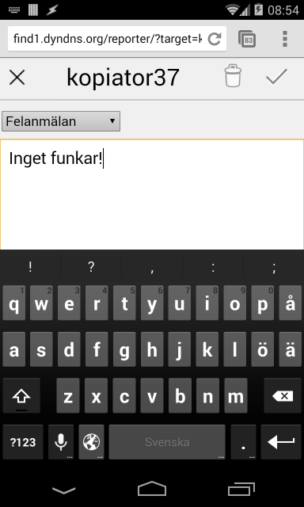
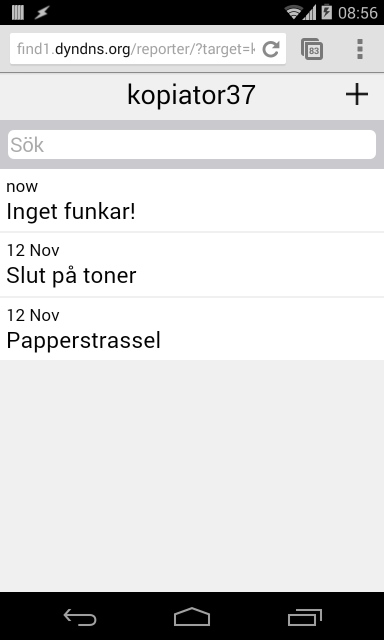

# Reporter

Web-app för att registrera felraporter, förslag mm.

* öppna med http://host/reporter/?target=thetarget där thetarget är den maskin etc som felrapporten gäller
* se alla rapporter för denna target eller skapa ny rapport
* en rapport innehåller
    * typ
    * beskrivning 
    * valfritt antal fotobilagor från mobil-kameran, eller inspelade ljudbilagor

## Exempel

Gå till http://host/reporter/?target=kopiator37

Klicka , välj typ och skriv en felbeskrivning

Klicka 

Klicka på rapporten

Klicka på kamera-symbolen

Ta en bild med kameran, och godkänn bilden. En kamera-symbol visar att en bilaga har lagts till. Klicka  för att spara bilagan i rapporten. Då man gör detta på en dator får man välja en bildfil istället för at använda kameran.

## Implementation

Jag trodde jag skulle behöva skriva en riktig App för android och iPhone för att implementer a detta, men det räcker ju med HTML5! Kräver ingen installation på användarens mobil heller.

### Arkitektur

Mobile visar webbsidan som hanterar data via en REST-tjänst på servern som lagrar data i en relationsdatabas.

REST-tjänst och web-app-filer servas av en node.js-server.
Web-appen är skriven med AngularJS och JQuery.

### Databasmodell

Uppladdade bilagor lagras i filer med namn lika med id för motsvarande attachment-objekt.

### Tabeller
    create table attachment (
        id int(7) NOT NULL auto_increment, 
        report int(7), 
        name varchar(255) NOT NULL, 
        mimetype varchar(100), 
        createdDate timestamp not null,
        PRIMARY KEY (id), UNIQUE id (id));
    
    CREATE TABLE report (
        id int(7) NOT NULL auto_increment, 
        target varchar(255),
        type varchar(100), 
        description varchar(255) NOT NULL,
        createdDate timestamp not null, 
        changedDate timestamp not null,
        PRIMARY KEY (id),UNIQUE id (id));
    
### REST-tjänst

Alla tjänster nedan returnerar http-status 200 då de lyckas.
De med id returnerar status 404 om id saknas.

* GET /ws/targets/:target/reports - returnerar lista av rapporter för target i JSON
* GET /ws/reports/:id - returnerar rapport med id i JSON
* POST /ws/reports - skapar ny rapport från postad JSON
* PUT /ws/reports/:id - uppdaterar rapport id från postad JSON
* DELETE /ws/reports/:id - tar bort raport id
* POST /ws/attachments - laddar upp mime-typad bilaga från postad binärdata, och returnerar id för det nya attachment-objektet
* GET /ws/attachments/:id/raw - returnerar  mime-typad binärdata för attachment med id
* DELETE /ws/attachments/:id

### kör servern

Checka ut koden i en mapp

#### Produktionsläge

Starta med:

    NODE_ENV=production nohup repeat server-mysql.js &
    
Vilket lyssnar på port 3000 och använder databasen reporter.

#### Utvecklingsläge

Starta med:

    NODE_ENV=development nohup nodemon server-mysql.js &

Som lyssnar på 3010 och använder databasen reporterdev, samt startar om servern så fort server-mysql.js ändrats.